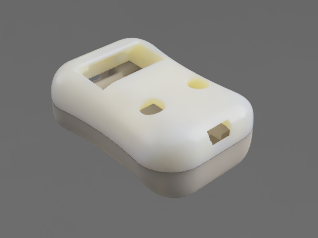
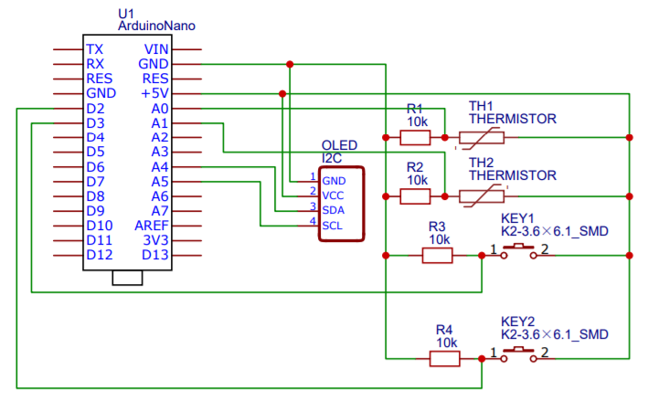

## Thermograph

An autonomous arduino-based thermometer with display and UART interface.

## Hardware

- Arduino Nano (or Uno)
- 2 buttons
- Themistor
- A few resistors

## Case

## Wiring

## Overview
There are 3 possible screens: LIVE, GRAPH and SETTINGS.

* LIVE screen simply shows current value of sensor.
* GRAPH screen allows to keep track of N (N == 128) last measurements and explore min/max values and exact values of measurements.
* SETTINGS screen gathers different options and controls of the device.

Device is controlled by 2 buttons: LEFT and RIGHT.

## Controls
(Coming soon)
<!-- #### LIVE screen
LIVE screen does not have any special submodes.
Single click of both LEFT and RIGHT buttons changes screen to GRAPH.
Holding RIGHT button switches screen to SETTINGS.

#### GRAPH screen
GRAPH screen can be switched to LIVE screen in the same way (by single clicks of both LEFT and RIGHT buttons).
SETTINGS screen can be reached in the same way (hold RIGHT button).

GRAPH screen has also a submode GRAPH_CURSOR, which can be entered by holding LEFT button.
In GRAPH_CURSOR submode click (or hold) either LEFT or RIGHT buttons to move cursor.
Hold both LEFT and RIGHT buttons to exit the submode.

#### SETTINGS screen
Current selected setting is showed by thin box around its name.
Single clicks of LEFT/RIGHT buttons moves selection to LEFT(UP)/RIGHT(DOWN).

Hold LEFT button to start changing (or activating) current setting.
Use LEFT/RIGHT buttons to change value of current setting.
Hold LEFT button to accept changes.

Hold RIGHT button to exit SETTINGS screen. -->

## TODO list

- Menu for choosing correct MP_MIN/MP_MAX/MP_CAP settings
- Pause timeout
- bcarray: correct wraping for cursor (leave unused space of last byte untouched!)
- Optimize memory usage
    - Display lib takes ~200 bytes of SRAM (+1KB is allocated dynamically on Heap)
    - Timers don't need all the internal variables (now each takes 13 bytes => 65 bytes in total)
    - Each GButton take ~23 bytes (could be less?), so ~46 bytes in total
    - use int16_t (100 times bigger, for .xx precision) instead of floats for measMin(G)/measMax(G) & tempValPartAverage
- Optimize flash usage
    - make eeprom validate and constrain part into one function
- [Pause] button (or option in graph timeout menu)
- Prettier USB mode display text
- Tiny ruller on graph cursor mode (for visual navigation, when exploring a lot of same values)
- getter/setter in RBCArray class
- may be (if enough flash space add build version)

## Known bugs

- displayWakeUp() does not work properly
- Time estimations r not accurate (should be rounded instead of flooring)
- Low memory
- Holding both buttons does not stop graph cursor from moving
- Not tested on Mega, but:
    - on Mega measData can be bigger than EEPROM can fit. not handle for this case atm

#### Non-realistic to fix/implement

- No time memory (only considers current graph timeout setting, even if the whole graph has been built with different graph timeout)